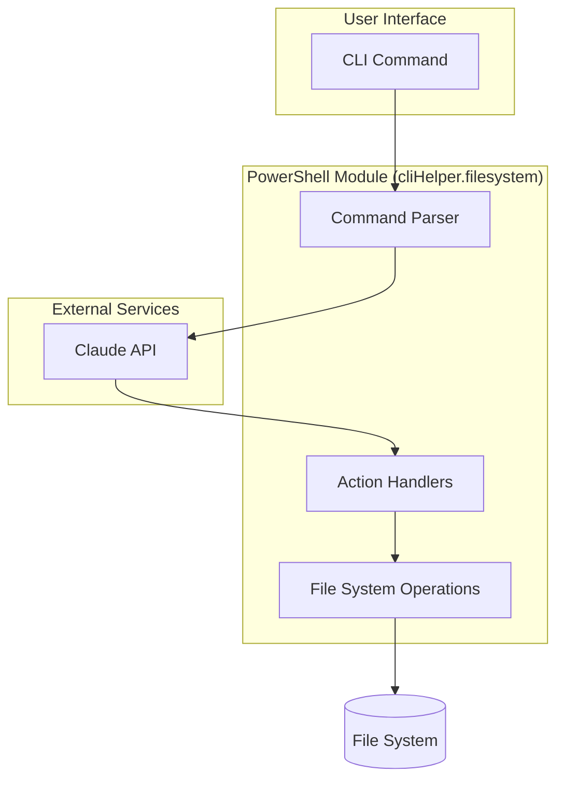

<!-- clihelper. -->

## Flowchart



## 📚 Commands

| Command                       | Description                                                      |
| ----------------------------- | ---------------------------------------------------------------- |
| `Invoke-cliHelper.filesystem` | Organizes files and directories based on natural language intent |
| `Get-ClaudeAdvice`            | Gets AI suggestions for organizing a directory                   |
| `Set-ClaudeConfig`            | Configures API settings and preferences                          |
| `Get-OrganizePreview`         | Shows preview of proposed changes                                |

## 🎯 Examples

```powershell
# Organize downloads by file type and date
Invoke-cliHelper.filesystem -Path "C:\Downloads" -Intent "separate by file type and create dated folders"

# Clean up a messy project folder
Invoke-cliHelper.filesystem -Path "D:\Work\Project123" -Intent "organize by component type and maintain git structure"

# Get suggestions for music library
Get-ClaudeAdvice -Path "E:\Music" -Intent "analyze organization patterns"
```
